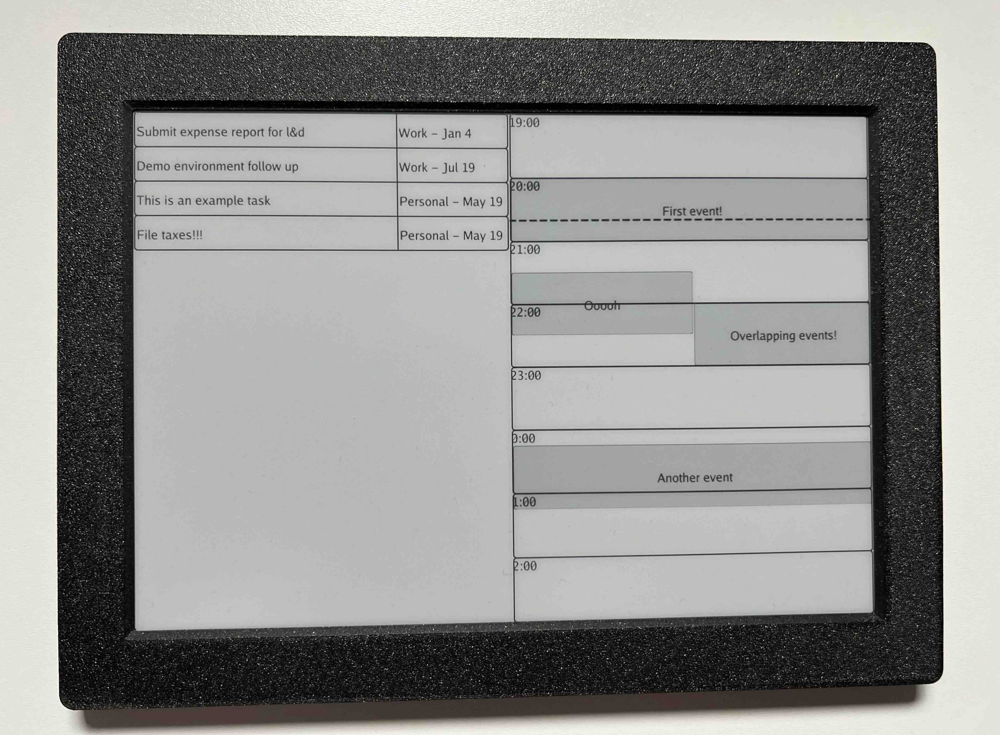

# GopherCal: eInk Calendar & Task Viewer

This Go program generates an image with your Todoist Tasks and Google calendar next to each other.

We use the calendar events that you've not said No to, and all the tasks that are over due or due today.

You can then show the image wherever you want, for example, on an [Inkplate](https://soldered.com/categories/inkplate/) or an [Inky Frame](https://shop.pimoroni.com/products/inky-frame-7-3?variant=40541882089555).

You can see an example here:



## Running GopherCal locally

We need credentials for Todoist and Google Calendar before we can run the server. You can see a walkthrough [here](./docs/creating-credentials.md).

### 1. Create a Todoist token

You can get your Todoist API token [as shown here](https://todoist.com/help/articles/find-your-api-token-Jpzx9IIlB).

### 2. Create OAuth clientID for Google Calendar

You need to authenticate with Google Calendar via OAuth. And this requires you to create an App in Google Cloud.

1. Create a project [as shown here](https://developers.google.com/workspace/guides/create-project) if you don't already have a project.
1. Enable the Calendar API [as shown here](https://developers.google.com/workspace/guides/enable-apis).
1. Configure OAuth scopes [as show here](https://developers.google.com/workspace/guides/configure-oauth-consent). You need to choose `auth/userinfo.email` and `calendar.events.readonly` scope.
1. Create OAuth client credentials [as shown here](https://developers.google.com/workspace/guides/create-credentials) and download the credentials file. You need to choose Desktop App, and store the credentials file.

You can see example of the steps here.

### 3. Create OAuth token for Google Calendar

You now need to run through the OAuth flow and create an access token.

```
$ go run scripts/generate-gcal-token/main.go
```

This will print a URL that you need to open in your browser. There will be a warning that this App is not approved, click on `continue` and once you're done, your token will be stored locally at `token.json`.

You are now all set to run GopherCal.

### Running the server locally

```
$ go run main.go run --gcal-email=<email> --todoist-token=<token>
```
```
Usage: gophercal run --todoist-token=STRING --gcal-email=STRING [flags]

Flags:
  -h, --help                                        Show context-sensitive help.

      --todoist-token=STRING                        Todoist API token ($TODOIST_TOKEN)
      --gcal-credentials-file="credentials.json"    Google Calendar credentials file
      --gcal-token-file="token.json"                Google Calendar token file
      --gcal-email=STRING                           Google Calendar email address
```

You can visit `http://localhost:8364/dash.jpg` to access the generated image.

### Running the server on a different machine

You can build the project using:

```
$ go build ./main.go -o gophercal
```

And then copy the `credentials.json` and `token.json` along with the `gophercal` binary. Or you can download the binary here: https://github.com/gouthamve/gophercal/releases/latest

You can then run the following on the remote server:

```
$ gophercal run --gcal-email=<email> --todoist-token=<token>
```

And access the generated image at `http://<server-ip>:8364/dash.jpg`.

## Setting up inkplate

I have the Arduino code for the Soldered Inkplate [here](./inkplate-dash/). 

Make sure to change the values in `inkplate-dash.ino`:

- `your_ssid_goes_here`
- `your_password_goes_here`
- `<server-url>`

You should set up your environment as described here: https://inkplate.readthedocs.io/en/latest/ and you can upload the `inkplate-dash.ino` after.

However, it is a simple loop that just downloads the image from `http://<server-url>:8364/dash.jpg` every 5 minutes.