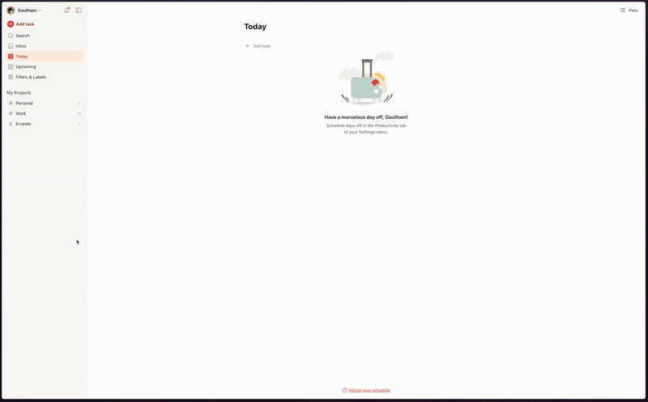
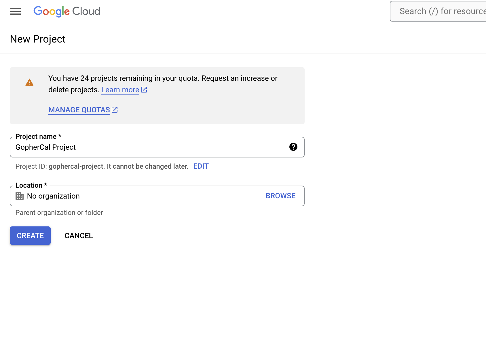
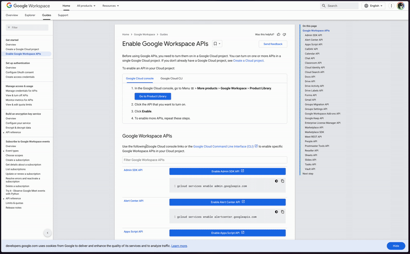
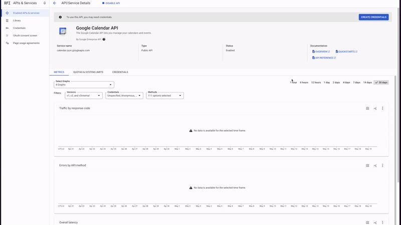
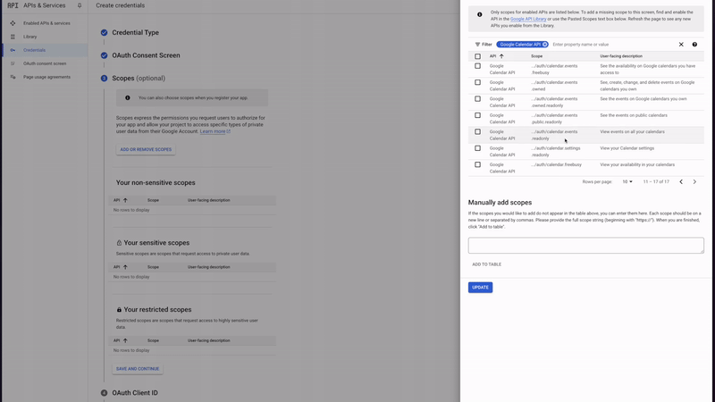

# Creating the credentials for gophercal

## Todoist.com API Key

See: https://todoist.com/help/articles/find-your-api-token-Jpzx9IIlB

## Google Calendar OAuth credentials

### Create a project

See: https://developers.google.com/workspace/guides/create-project

### Enable Calendar API

See: https://developers.google.com/workspace/guides/enable-apis

### Configure OAuth scopes and credentials

See: https://console.cloud.google.com/apis/api/calendar-json.googleapis.com/metrics

You need to choose `auth/userinfo.email` and `calendar.events.readonly` scope.

## Create client credentials

See: https://developers.google.com/workspace/guides/create-credentials

You need to select a Desktop App and download the credentials JSON file. Now save it as `credentials.json` in the folder with gophercal.

